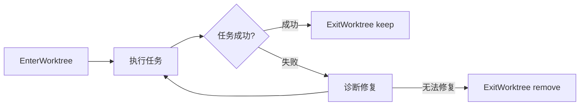

# Git Worktree 使用规范

**版本:** 1.0
**日期:** 2026-04-13
**来源:** Superpowers Pipeline v6.1

---

## 1. Worktree 概述

### 1.1 什么是 Git Worktree

Git Worktree 允许在同一个仓库中创建多个工作目录，每个目录可以指向不同的分支或提交。

```
┌─────────────────────────────────────────────────────────────────────────────┐
│                        Git Worktree 多工作树架构                              │
├─────────────────────────────────────────────────────────────────────────────┤
│                                                                             │
│  主仓库 (main branch)                                                        │
│  /Users/project/                                                            │
│       │                                                                     │
│       ├── .git/               # 共享 Git 目录                                │
│       ├── .git/worktrees/     # Worktree 元数据                             │
│       ├── src/                # 主分支代码                                   │
│       └── ...                                                                │
│                                                                             │
│  Worktree 1 (feature-a branch)              Worktree 2 (feature-b branch)   │
│  /Users/project/.claude/worktrees/feature-a │ /Users/project/.claude/...    │
│       │                                     │                               │
│       ├── src/                # feature-a 代码│ ├── src/  # feature-b 代码   │
│       └── ...                                │ └── ...                       │
│                                                                             │
│  优势:                                                                       │
│  ✅ 共享 .git 目录，节省空间                                                  │
│  ✅ 独立工作环境，互不干扰                                                     │
│  ✅ 无需 stash 或 clone 多份                                                 │
│  ✅ 可同时开发多个功能                                                        │
│                                                                             │
└─────────────────────────────────────────────────────────────────────────────┘
```

### 1.2 为什么使用 Worktree

| 场景 | 传统方式 | Worktree 方式 |
|------|----------|---------------|
| 多功能并行开发 | stash / clone 多份 | 创建多个 worktree |
| 实验性开发 | 创建临时分支 | 在隔离 worktree 实验 |
| Subagent 执行 | 同一目录可能冲突 | 每个 subagent 独立 worktree |
| 任务失败回滚 | 需要手动清理 | 直接删除 worktree |

---

## 2. Worktree 在 Superpowers 流程中的作用

### 2.1 Phase 3 实施隔离

```
┌─────────────────────────────────────────────────────────────────────────────┐
│                   Subagent-Driven Development (SDD)                          │
├─────────────────────────────────────────────────────────────────────────────┤
│                                                                             │
│  Controller Agent                                                            │
│       │                                                                     │
│       ↓ EnterWorktree                                                        │
│  ┌────┴────┬────────────┬────────────┐                                     │
│  │         │            │            │                                      │
│  ↓         ↓            ↓            ↓                                      │
│ Task 1   Task 2       Task 3       Task N                                   │
│ (新 subagent) (新 subagent) (新 subagent) (新 subagent)                     │
│     │         │            │            │                                    │
│     ↓         ↓            ↓            ↓                                    │
│  Worktree  Worktree    Worktree    Worktree                                 │
│  .claude/  .claude/    .claude/    .claude/                                 │
│  wt-001    wt-002      wt-003      wt-N                                     │
│                                                                             │
│  每个 subagent 在独立 worktree 中执行：                                       │
│  - 防止上下文污染                                                            │
│  - 失败任务可独立回滚                                                        │
│  - 不影响其他任务执行                                                        │
│                                                                             │
└─────────────────────────────────────────────────────────────────────────────┘
```

### 2.2 Worktree 生命周期



---

## 3. EnterWorktree 工具

### 3.1 功能说明

创建隔离的 Git Worktree，切换当前会话工作目录到新 worktree。

### 3.2 参数

| 参数 | 类型 | 说明 |
|------|------|------|
| `name` | string | Worktree 名称 (可选，默认自动生成) |

### 3.3 命名规范

```
命名规则: {feature-name}-{task-id}
示例: course-exchange-001, user-auth-002
```

### 3.4 使用示例

```typescript
// 创建 worktree
EnterWorktree({ name: "course-exchange-001" })

// 在 worktree 中执行任务
// ...

// 完成后退出
ExitWorktree({ action: "keep" })    // 保留 worktree
ExitWorktree({ action: "remove" })  // 删除 worktree
```

---

## 4. ExitWorktree 工具

### 4.1 功能说明

退出当前 Worktree，恢复到原始工作目录。

### 4.2 参数

| 参数 | 类型 | 说明 |
|------|------|------|
| `action` | string | "keep" 或 "remove" |
| `discard_changes` | boolean | 是否丢弃未提交更改 (仅 remove 时有效) |

### 4.3 行为说明

| Action | 行为 |
|--------|------|
| **keep** | 保留 worktree 和分支，可后续继续使用 |
| **remove** | 删除 worktree 目录和分支，清理干净 |

### 4.4 注意事项

```
⚠️ ExitWorktree remove 会拒绝删除：
- 有未提交文件
- 有未合并的提交

除非设置 discard_changes: true
```

---

## 5. Worktree 使用场景

### 5.1 场景一：新功能开发

```bash
# 1. 进入 worktree
EnterWorktree({ name: "feature-course-list" })

# 2. 在 worktree 中开发
# - 创建 Models
# - 创建 ViewModels
# - 创建 Views
# - 编写测试

# 3. 自测通过后退出
ExitWorktree({ action: "keep" })

# 4. 后续继续开发时重新进入
EnterWorktree({ name: "feature-course-list" })
```

### 5.2 场景二：Subagent 任务执行

```bash
# Controller Agent 分发任务

# Task 1: 实现 CourseModel
EnterWorktree({ name: "course-model-001" })
# 执行 RED-GREEN-REFACTOR
ExitWorktree({ action: "keep" })

# Task 2: 实现 CourseViewModel
EnterWorktree({ name: "course-vm-002" })
# 执行 RED-GREEN-REFACTOR
ExitWorktree({ action: "keep" })

# Task 3: 实现 CourseListView
EnterWorktree({ name: "course-view-003" })
# 执行 RED-GREEN-REFACTOR
ExitWorktree({ action: "keep" })
```

### 5.3 场景三：实验性开发

```bash
# 1. 创建实验 worktree
EnterWorktree({ name: "experiment-new-arch" })

# 2. 实验失败，直接删除
ExitWorktree({ action: "remove", discard_changes: true })

# 3. 主仓库完全不受影响
```

### 5.4 场景四：紧急 Bug 修复

```bash
# 1. 主仓库正在开发 feature-a
# 2. 收到紧急 Bug 修复请求

# 3. 创建 Bug 修复 worktree
EnterWorktree({ name: "hotfix-login-crash" })

# 4. 修复 Bug
# 5. 合并到 main
ExitWorktree({ action: "remove" })

# 6. 继续 feature-a 开发
```

---

## 6. Worktree 状态检查

### 6.1 查看所有 Worktree

```bash
# Git 命令
git worktree list

# 输出示例
/Users/project/                  abc1234 [main]
/Users/project/.claude/worktrees/feature-a  def5678 [feature-a]
/Users/project/.claude/worktrees/feature-b  ghi9012 [feature-b]
```

### 6.2 检查 Worktree 状态

```bash
# 在 worktree 中
git status
git branch
```

---

## 7. Worktree 与 Branch 关系

### 7.1 自动分支创建

```text
EnterWorktree 行为:
1. 创建新分支 (基于 HEAD)
2. 创建 worktree 目录
3. 切换工作目录到 worktree
4. 新分支自动 checkout
```

### 7.2 分支命名

```text
Worktree 名称: feature-course-list
自动分支名称: feature-course-list (同名)
```

---

## 8. Worktree 最佳实践

### 8.1 命名规范

| 好的命名 | 不好的命名 |
|----------|------------|
| `course-list-001` | `test` |
| `user-auth-002` | `tmp` |
| `hotfix-crash-003` | `fix` |

### 8.2 Action 选择

| 场景 | Action |
|------|--------|
| 功能开发完成，准备合并 | `keep` |
| 任务失败，需要清理 | `remove` |
| 实验性开发失败 | `remove` |
| 后续需要继续开发 | `keep` |

### 8.3 清理策略

```
定期清理不需要的 worktree:
git worktree prune
git worktree remove <path>
```

---

## 9. Worktree 常见问题

### 9.1 Worktree 目录位置

```
默认位置: .claude/worktrees/{name}

如果项目不在 git 仓库中:
EnterWorktree 会使用 WorktreeCreate/WorktreeRemove hooks
```

### 9.2 Worktree 数量限制

```
建议上限: 5-10 个活跃 worktree
原因: 过多 worktree 可能影响性能
```

### 9.3 Worktree 与 Submodule

```
Worktree 会共享 submodule
如果 submodule 有变化，需要单独处理
```

---

## 10. Worktree 检查清单

### 创建前检查

```text
☐ 确认当前在 git 仓库中
☐ 确认命名符合规范
☐ 确认无未提交的重要更改
```

### 使用中检查

```text
☐ 任务执行在 worktree 目录中
☐ 定期检查 git status
☐ 及时提交阶段性成果
```

### 退出前检查

```text
☐ 确认所有更改已处理
☐ 选择正确的 action (keep/remove)
☐ 如有未提交更改，确认 discard_choices
```

---

## 11. Worktree 工具参考

### EnterWorktree

```typescript
// 工具签名
{
  name: "EnterWorktree",
  description: "创建隔离 git worktree 并切换会话到其中",
  parameters: {
    name: {
      type: "string",
      description: "Worktree 名称，可选，默认自动生成"
    }
  }
}
```

### ExitWorktree

```typescript
// 工具签名
{
  name: "ExitWorktree",
  description: "退出 worktree 会话，返回原始目录",
  parameters: {
    action: {
      type: "string",
      enum: ["keep", "remove"],
      description: "keep: 保留 worktree; remove: 删除 worktree"
    },
    discard_changes: {
      type: "boolean",
      description: "是否丢弃未提交更改，仅 remove 时有效"
    }
  }
}
```

---

**版本**: 1.0
**更新日期**: 2026-04-13
**适用范围**: 跨平台移动开发团队
**来源**: Superpowers Pipeline v6.1