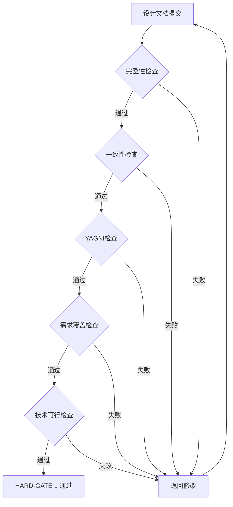
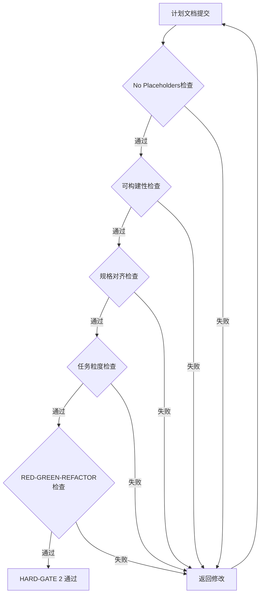
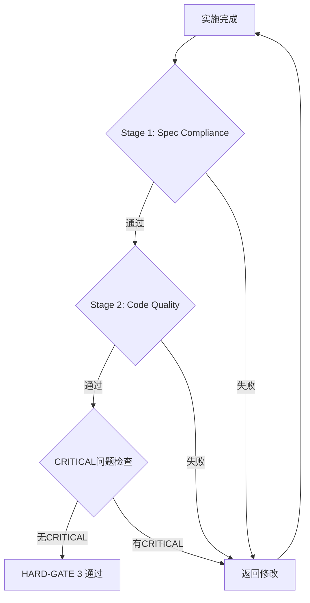

# 量关卡 (Quality Gates)

**版本:** 2.0  
**日期:** 2026-04-13  
**来源:** Superpowers Pipeline v6.1

---

## 1. 硬门禁概览

```
┌─────────────────────────────────────────────────────────────────────────────┐
│                        三阶段硬门禁流程                                       │
├─────────────────────────────────────────────────────────────────────────────┤
│                                                                             │
│  Phase 1: Design      HARD-GATE 1      Phase 2: Planning                   │
│  (brainstorming)   ─────────────────→   (writing-plans)                    │
│                          ↓                                                  │
│                   "禁止未批准实施"                                           │
│                                                                             │
│                    HARD-GATE 2                                              │
│                   "计划必须可构建"                                           │
│                          ↓                                                  │
│  Phase 3: Implement  ─────────────────→  HARD-GATE 3                        │
│  (SDD)                   ↓             "规格合规 + 代码质量"                 │
│                          ↓                                                  │
│                    批准合并                                                  │
│                                                                             │
└─────────────────────────────────────────────────────────────────────────────┘
```

### 硬门禁定义

| 类型 | 说明 | 行为 |
|------|------|------|
| **HARD-GATE** | 强制阻塞 | 不通过 = 禁止进入下一阶段 |
| **SOFT-GATE** | 建议检查 | 不通过 = 警告但可继续 |

---

## 2. HARD-GATE 1: Design Approved

### 2.1 触发条件

设计阶段完成，产出 `docs/superpowers/specs/YYYY-MM-DD-<topic>-design.md`

### 2.2 阻塞行为

```
⚠️ HARD-GATE: 禁止在未批准设计前实施

未通过 → 禁止进入 Phase 2: Planning
```

### 2.3 检查项

| 检查项 | 标准 | 责任人 |
|--------|------|--------|
| 完整性 | 无 TBD 或占位符 | Architect |
| 一致性 | 无内部矛盾 | Architect |
| YAGNI | 无过度设计 | Architect |
| 需求覆盖 | 覆盖 PRD 所有需求 | PM |
| 技术可行 | 技术可实现 | Architect |

### 2.4 审查流程



### 2.5 准出条件

- [x] 完整性: 无 TBD 或占位符
- [x] 一致性: 无内部矛盾
- [x] YAGNI: 无过度设计
- [x] 需求覆盖: 覆盖 PRD 所有需求
- [x] 技术可行: 技术可实现
- [x] Architect 批准签字

---

## 3. HARD-GATE 2: Plan Buildable

### 3.1 触发条件

规划阶段完成，产出 `docs/superpowers/plans/YYYY-MM-DD-<feature-name>.md`

### 3.2 阻塞行为

```
⚠️ HARD-GATE: 计划必须可构建

未通过 → 禁止进入 Phase 3: Implementation
```

### 3.3 检查项

| 检查项 | 标准 | 责任人 |
|--------|------|--------|
| 可构建性 | 工程师可无阻塞执行 | Architect |
| 规格对齐 | 覆盖设计规格所有需求 | Architect |
| No Placeholders | 无 TBD/模糊描述/占位符 | Architect |
| 任务粒度 | 每任务 2-5 分钟 | Specialist |
| RED-GREEN-REFACTOR | 包含完整测试循环 | QA |

### 3.4 No Placeholders 规则

**计划失败条件 (必须重新规划):**

| 问题类型 | 示例 | 检查方式 |
|----------|------|----------|
| TBD/模糊 | "TBD: 待确认" | grep "TBD" |
| 未定义引用 | "类似 Task N" | grep "类似" |
| 占位符 | "// ... existing code ..." | grep "... existing" |

### 3.5 审查流程



### 3.6 准出条件

- [x] No Placeholders: 无 TBD/模糊描述/占位符
- [x] 可构建性: 工程师可无阻塞执行
- [x] 规格对齐: 覆盖设计规格所有需求
- [x] 任务粒度: 每任务 2-5 分钟
- [x] RED-GREEN-REFACTOR: 包含完整测试循环
- [x] Architect 批准签字

---

## 4. HARD-GATE 3: Spec Compliance + Code Quality

### 4.1 触发条件

实施阶段完成，所有任务执行完毕

### 4.2 阻塞行为

```
⚠️ HARD-GATE: 规格合规 + 代码质量

未通过 → 禁止合并到主分支
```

### 4.3 双阶段审查

#### Stage 1: Spec Compliance 检查

| 检查项 | 标准 | 责任人 |
|--------|------|--------|
| 需求满足 | 满足设计规格所有需求 | Architect |
| 数据模型一致 | 与设计规格一致 | Architect |
| API 接口一致 | 与设计规格一致 | Architect |
| UI/UX 实现一致 | 与设计规格一致 | PM |

#### Stage 2: Code Quality 检查

| 检查项 | 标准 | 责任人 |
|--------|------|--------|
| 代码规范 | 符合编码规范 | Specialist |
| 测试覆盖率 | ≥80% | QA |
| 无安全漏洞 | 无 OWASP Top 10 漏洞 | Security |
| 性能无回归 | 无明显性能问题 | QA |

### 4.4 审查流程



### 4.5 问题分级

| 优先级 | 说明 | 处理时限 | 阻塞合并 |
|--------|------|----------|----------|
| **CRITICAL** | 必须修复 | 24 小时 | ✅ 阻塞 |
| **HIGH** | 应该修复 | 48 小时 | ✅ 阻塞 |
| **MEDIUM** | 建议修复 | 下周迭代 | ❌ 不阻塞 |
| **LOW** | 可选修复 | 技术债跟踪 | ❌ 不阻塞 |

### 4.6 准出条件

**Stage 1 通过:**
- [x] 需求满足: 满足设计规格所有需求
- [x] 数据模型一致: 与设计规格一致
- [x] API 接口一致: 与设计规格一致
- [x] UI/UX 实现一致: 与设计规格一致

**Stage 2 通过:**
- [x] 代码规范: 符合编码规范
- [x] 测试覆盖率: ≥80%
- [x] 无安全漏洞: 无 CRITICAL/HIGH 安全问题
- [x] 性能无回归: 无明显性能问题

**最终批准:**
- [x] 无 CRITICAL 问题
- [x] 无 HIGH 问题 (或已修复)
- [x] Architect 批准签字

---

## 5. 门禁对比

### v1.0 vs v2.0

| 维度 | v1.0 (软门禁) | v2.0 (硬门禁) |
|------|---------------|---------------|
| 门禁数量 | 6 个 | 3 个 |
| 阻塞行为 | 建议检查 | **强制阻塞** |
| 设计门禁 | Gate 1 (建议) | **HARD-GATE 1 (阻塞)** |
| 规划门禁 | 无 | **HARD-GATE 2 (阻塞)** |
| 实施门禁 | Gate 3 (建议) | **HARD-GATE 3 (阻塞)** |
| No Placeholders | 无 | **强制检查** |
| 任务粒度 | 无要求 | **2-5 分钟强制** |

---

## 6. 门禁检查清单汇总

### HARD-GATE 1 检查清单

```text
完整性检查:
☐ 无 TBD 或占位符
☐ 所有章节完整填写

一致性检查:
☐ 数据模型与 API 一致
☐ UI/UX 与需求一致
☐ 无内部矛盾

YAGNI 检查:
☐ 无过度设计
☐ 无未使用的抽象

需求覆盖检查:
☐ 覆盖 PRD 所有需求
☐ 边界条件已考虑

技术可行检查:
☐ 技术可实现
☐ 无明显风险
```

### HARD-GATE 2 检查清单

```text
No Placeholders 检查:
☐ 无 "TBD" 字样
☐ 无 "类似 Task N" 简写
☐ 无 "// ... existing code ..." 占位符

可构建性检查:
☐ 文件路径明确
☐ 代码片段完整
☐ 依赖关系清晰

规格对齐检查:
☐ 覆盖设计规格所有需求
☐ 无遗漏功能点

任务粒度检查:
☐ 每任务 2-5 分钟
☐ 包含 RED-GREEN-REFACTOR 循环
```

### HARD-GATE 3 检查清单

```text
Stage 1: Spec Compliance
☐ 满足设计规格所有需求
☐ 数据模型一致
☐ API 接口一致
☐ UI/UX 实现一致

Stage 2: Code Quality
☐ 代码规范通过
☐ 测试覆盖率 ≥80%
☐ 无 CRITICAL/HIGH 安全漏洞
☐ 性能无回归
```

---

## 7. 审查报告模板

### 审查报告路径

```
docs/superpowers/reviews/YYYY-MM-DD-<feature-name>-review.md
```

### 审查报告结构

```markdown
# {功能名称} - 审查报告

**日期:** YYYY-MM-DD
**设计规格:** ../specs/YYYY-MM-DD-<topic>-design.md
**实施计划:** ../plans/YYYY-MM-DD-<feature-name>.md
**审查人:** @reviewer

---

## HARD-GATE 1 审查结论

- [ ] ✅ 通过
- [ ] ❌ 需修改

**问题列表:**

| ID | 问题 | 章节 | 建议 |
|----|------|------|------|
| | | | |

---

## HARD-GATE 2 审查结论

- [ ] ✅ 通过
- [ ] ❌ 需修改 (No Placeholders 问题)

**问题列表:**

| ID | 问题 | 位置 | 建议 |
|----|------|------|------|
| | | | |

---

## HARD-GATE 3 审查结论

### Stage 1: Spec Compliance

- [ ] ✅ 通过
- [ ] ❌ 需修改

### Stage 2: Code Quality

- [ ] ✅ 通过
- [ ] ❌ 需修改

**问题分级:**

| ID | 级别 | 问题 | 位置 | 建议 |
|----|------|------|------|------|
| | CRITICAL/HIGH/MEDIUM/LOW | | | |

---

## 最终结论

- [ ] ✅ 批准合并
- [ ] ⚠️ 有条件批准 (需修复 HIGH 问题)
- [ ] ❌ 驳回 (需修复 CRITICAL 问题)

---

**审查人签字:** @reviewer
**日期:** YYYY-MM-DD
```

---

## 8. 自动化检查脚本

### No Placeholders 检查脚本

```bash
#!/bin/bash
# check-no-placeholders.sh

PLAN_FILE="$1"

# 检查 TBD
if grep -q "TBD" "$PLAN_FILE"; then
    echo "❌ 发现 TBD 字样"
    grep -n "TBD" "$PLAN_FILE"
    exit 1
fi

# 检查 "类似" 简写
if grep -q "类似 Task" "$PLAN_FILE"; then
    echo "❌ 发现未定义引用"
    grep -n "类似 Task" "$PLAN_FILE"
    exit 1
fi

# 检查占位符
if grep -q "... existing code" "$PLAN_FILE"; then
    echo "❌ 发现占位符"
    grep -n "... existing code" "$PLAN_FILE"
    exit 1
fi

echo "✅ No Placeholders 检查通过"
exit 0
```

### 测试覆盖率检查脚本

```bash
#!/bin/bash
# check-coverage.sh

COVERAGE_REPORT="$1"
MIN_COVERAGE=80

# 提取覆盖率数值
coverage=$(grep "覆盖率" "$COVERAGE_REPORT" | awk '{print $2}' | sed 's/%//')

if [ "$coverage" -lt "$MIN_COVERAGE" ]; then
    echo "❌ 测试覆盖率 $coverage% < $MIN_COVERAGE%"
    exit 1
fi

echo "✅ 测试覆盖率 $coverage% 达标"
exit 0
```

---

## 9. 质量指标

| 指标 | 目标值 | 说明 |
|------|--------|------|
| HARD-GATE 1 通过率 | >90% | 设计规格首次通过率 |
| HARD-GATE 2 通过率 | >85% | 实施计划首次通过率 |
| HARD-GATE 3 通过率 | >80% | 实施审查首次通过率 |
| No Placeholders 违规率 | 0% | 禁止任何占位符 |
| 测试覆盖率 | ≥80% | 最低覆盖率要求 |
| CRITICAL 问题率 | 0% | 禁止 CRITICAL 问题 |

---

**版本**: 2.0
**更新日期**: 2026-04-13
**适用范围**: 跨平台移动开发团队
**来源**: Superpowers Pipeline v6.1